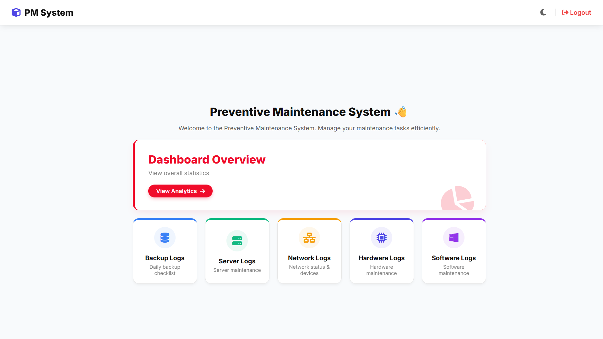
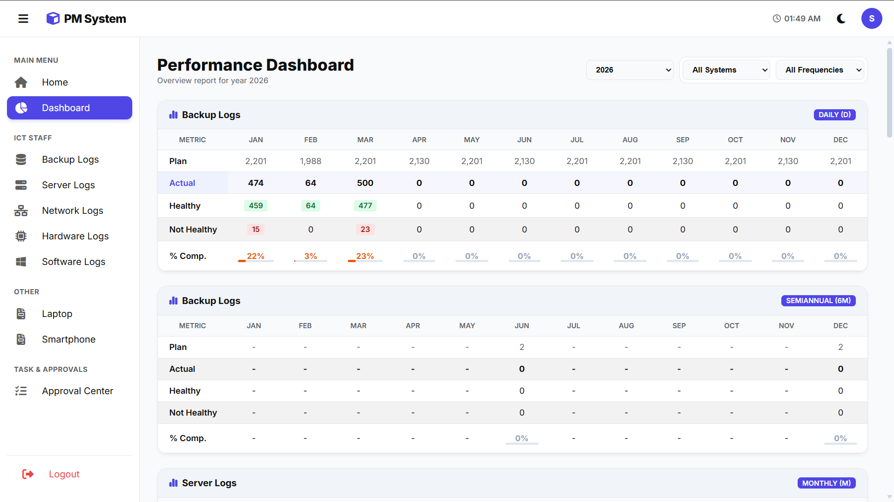
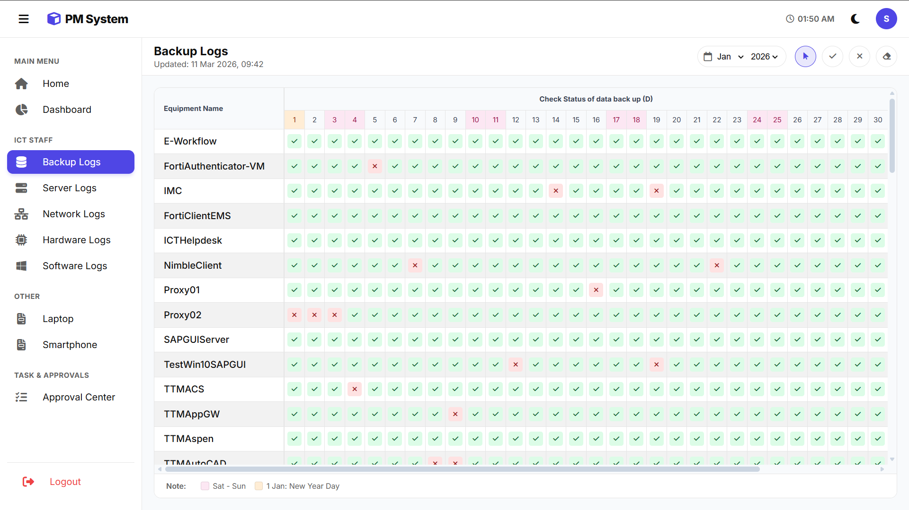

# 🛡️ Enterprise IT Preventive Maintenance System (PM Monitor)

> **Centralized platform for monitoring, logging, and analyzing IT infrastructure health.**
> *Transforming manual maintenance routines into a digital, real-time, and auditable workflow.*



---

## 📖 Executive Summary

ระบบ **IT Preventive Maintenance (PM System)** ถูกออกแบบมาเพื่อยกระดับมาตรฐานการดูแลรักษาโครงสร้างพื้นฐานไอที (IT Infrastructure) ภายในองค์กร โดยเปลี่ยนจากระบบเอกสาร (Paper-based) มาสู่รูปแบบดิจิทัล (Digital Transformation) อย่างเต็มรูปแบบ

ระบบนี้ช่วยให้ผู้บริหารไอที (IT Managers) และผู้ดูแลระบบ (System Admins) สามารถติดตามสถานะความพร้อมของอุปกรณ์ Server, Network, Hardware และ Backup ได้แบบ Real-time พร้อมทั้งสร้างประวัติการตรวจสอบ (Audit Trail) ที่โปร่งใสและตรวจสอบย้อนหลังได้ง่าย

---

## 📸 System Interface & Analytics

### 📊 1. Executive Dashboard (The "War Room")
หน้าจอสรุปผลสำหรับผู้บริหาร เพื่อประเมิน "สุขภาพรวม" ของระบบไอทีในองค์กร
* **Completion Rate:** ติดตาม % ความคืบหน้าของการตรวจเช็คประจำเดือน (KPI Tracking)
* **Health Status:** แจ้งเตือนทันทีเมื่อพบอุปกรณ์ที่มีสถานะ "Not Healthy" หรือมีความเสี่ยง
* **Trend Analysis:** กราฟแสดงแนวโน้มความมีวินัยในการบำรุงรักษาตลอดทั้งปี



### ✅ 2. Operational Log Modules
หน้าจอปฏิบัติงานสำหรับเจ้าหน้าที่ IT Support ออกแบบมาให้ใช้งานง่าย ลดความซับซ้อนในการกรอกข้อมูล
* **Interactive Checklist:** ตารางบันทึกผลรายวันพร้อม Status Toggle (Pass/Fail)
* **Dynamic Tasks:** หัวข้อการตรวจสอบถูกดึงมาจากฐานข้อมูลตามการตั้งค่า (Configurable)
* **Auto-Save System:** บันทึกข้อมูลทันทีด้วยเทคโนโลยี AJAX ป้องกันข้อมูลสูญหาย



---

## 🚀 Key Modules & Capabilities

ระบบถูกแบ่งออกเป็นโมดูลตามประเภทของ Infrastructure เพื่อความชัดเจนในการดูแลรักษา:

### 🖥️ Server Maintenance Module
* **Target:** Physical Servers, Virtual Machines (VM), Database Servers
* **Key Checks:** อุณหภูมิห้อง Server (Temperature), พื้นที่จัดเก็บข้อมูล (Disk Space), การทำงานของพัดลมระบายความร้อน
* **Outcome:** ป้องกันปัญหา Server Overheat และ Storage เต็มก่อนที่จะเกิด Downtime

### 🌐 Network Maintenance Module
* **Target:** Core Switches, Firewalls, Routers, Wi-Fi Access Points
* **Key Checks:** ปริมาณ Bandwidth, สถานะ Port, ความเสถียรของสัญญาณ (Latency)
* **Outcome:** รับประกันความเสถียรของการเชื่อมต่อเครือข่าย และตรวจสอบจุดบอดของระบบ

### 💾 Backup Verification Module
* **Target:** Tape Libraries, Cloud Backup, NAS Storage
* **Key Checks:** ตรวจสอบความสมบูรณ์ของไฟล์ Backup รายวัน, ทดสอบการ Restore ข้อมูล
* **Outcome:** ลดความเสี่ยงข้อมูลสูญหาย (Data Loss) จาก Ransomware หรือภัยพิบัติ

### 🔌 Hardware & Software Module
* **Target:** UPS (สำรองไฟ), Workstations, License Management
* **Key Checks:** ค่าสถานะแบตเตอรี่ UPS, การอัปเดต Patch ความปลอดภัย, อายุ License
* **Outcome:** เตรียมความพร้อมระบบไฟฟ้าสำรองและความปลอดภัยทางไซเบอร์

---

## 🔄 Operational Workflow

กระบวนการทำงานของระบบตั้งแตต้นน้ำจนถึงปลายน้ำ:

1.  **Configuration (Admin Level):**
    * ผู้ดูแลระบบกำหนดรายชื่ออุปกรณ์ (Assets) และหัวข้อการตรวจเช็ค (Tasks) ผ่านเมนู System Config
2.  **Daily Routine (User Level):**
    * เจ้าหน้าที่ IT เข้าสู่ระบบและทำการตรวจสอบอุปกรณ์ตามรอบงาน (Daily/Monthly)
3.  **Data Entry:**
    * บันทึกผลการตรวจสอบ (Pass/Fail) ลงในระบบผ่านหน้า Web Portal
4.  **Validation & Logging:**
    * ระบบบันทึกเวลา (Timestamp) และผู้กระทำ (User ID) เพื่อใช้เป็นหลักฐานอ้างอิง (Audit Log)
5.  **Visualization:**
    * ข้อมูลถูกประมวลผลและแสดงผลบน Dashboard ทันทีเพื่อให้ผู้บริหารรับทราบสถานะ

---

## 🛠️ Technical Stack

พัฒนาด้วยเทคโนโลยีมาตรฐานระดับองค์กร เน้นความเสถียร (Stability) และการดูแลรักษาที่ง่าย (Maintainability):

* **Frontend:** HTML5, CSS3 (Custom Enterprise Theme), Vanilla JavaScript
* **Backend:** PHP 8.0+ (Optimized for performance)
* **Database:** MySQL / MariaDB (Relational Database)
* **Security:** Session-based Authentication, SQL Injection Protection, Role-Based Access Control (RBAC)

---

## ⚙️ Quick Start Guide

1.  **Clone Repository:**
    ```bash
    git clone [https://github.com/yourusername/pm-system.git](https://github.com/yourusername/pm-system.git)
    ```
2.  **Database Setup:**
    * สร้างฐานข้อมูลชื่อ `monitor_db`
    * Import ไฟล์ `monitor_db.sql` เข้าสู่ MySQL
3.  **Configuration:**
    * แก้ไขไฟล์ `db.php` เพื่อระบุค่า Database Connection ของคุณ
4.  **Access System:**
    * เปิด Browser ไปที่ `http://localhost/pm-system/`
    * **Login:** `admin` / `password` (Default)

---

### 📄 License
Copyright © 2026. Distributed under the MIT License.
