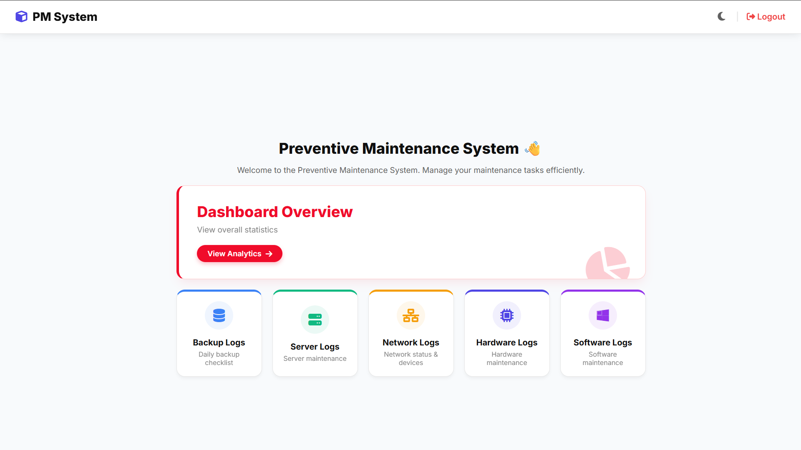
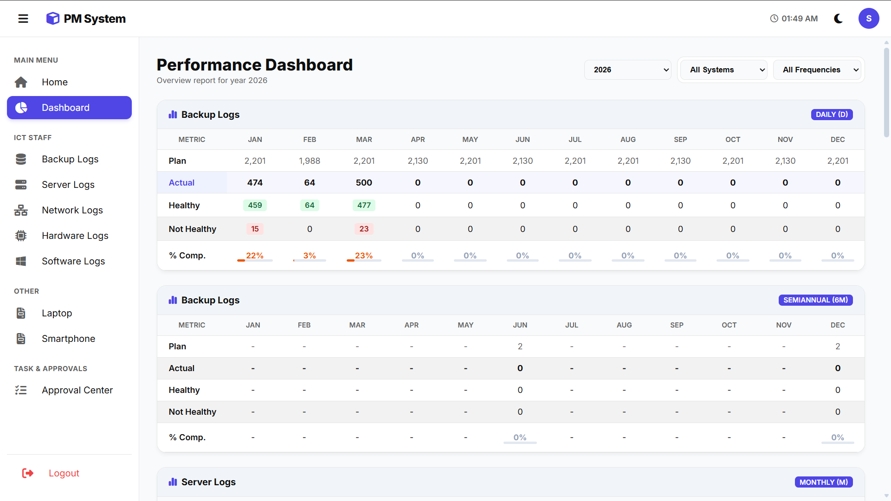
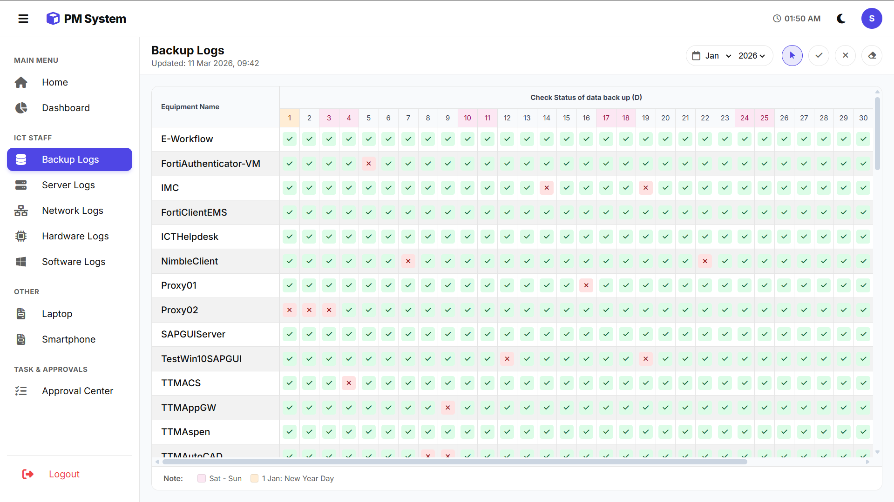
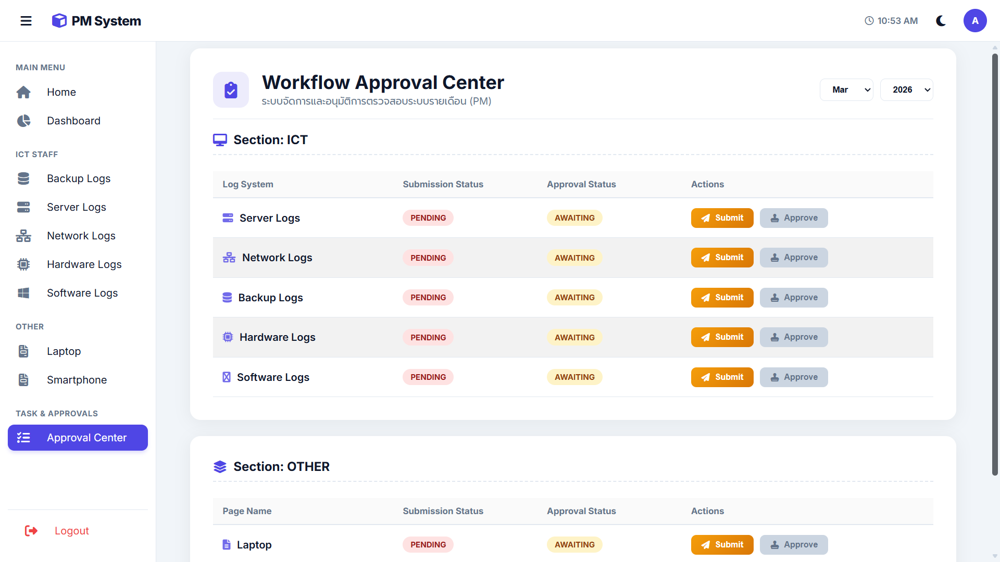
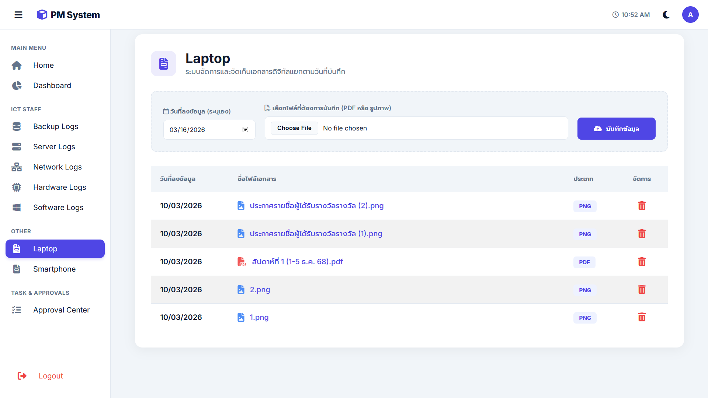

# 🛡️ Enterprise IT Preventive Maintenance System (PM Monitor)

> **Centralized platform for monitoring, logging, and analyzing IT infrastructure health.**  
> *Transforming manual maintenance routines into a digital, real-time, and auditable workflow.*



---

## 📖 Executive Summary

ระบบ **IT Preventive Maintenance (PM System)** ถูกออกแบบมาเพื่อยกระดับมาตรฐานการดูแลรักษาโครงสร้างพื้นฐานไอที (IT Infrastructure) ภายในองค์กร โดยเปลี่ยนจากระบบเอกสาร (Paper-based) มาสู่รูปแบบดิจิทัล (Digital Transformation) อย่างเต็มรูปแบบ

ระบบนี้ช่วยให้ผู้บริหารไอที (IT Managers) และผู้ดูแลระบบ (System Admins) สามารถติดตามสถานะความพร้อมของอุปกรณ์ Server, Network, Hardware, Software และ Backup ได้แบบ Real-time พร้อมทั้งสร้างประวัติการตรวจสอบ (Audit Trail) ที่โปร่งใสและตรวจสอบย้อนหลังได้ง่าย

---

## 📸 System Interface & Analytics

### 📊 1. Executive Dashboard
หน้าจอสรุปผลสำหรับผู้บริหาร เพื่อประเมิน "สุขภาพรวม" ของระบบไอทีในองค์กร
- **Completion Rate:** ติดตาม % ความคืบหน้าของการตรวจเช็คประจำเดือน (KPI Tracking)
- **Health Status:** แสดงสถานะ Healthy / Not Healthy แยกตามระบบและ Frequency
- **Multi-Frequency Support:** รองรับ Daily (D), Monthly (M), Quarterly (3M), Semiannual (6M), Yearly (Y)



### ✅ 2. Operational Log Modules
หน้าจอปฏิบัติงานสำหรับเจ้าหน้าที่ IT ออกแบบมาให้ใช้งานง่าย ลดความซับซ้อนในการกรอกข้อมูล
- **Interactive Checklist:** ตารางบันทึกผลพร้อม Status Toggle (Pass ✓ / Fail ✗ / Erase)
- **Dynamic Tasks:** หัวข้อการตรวจสอบดึงมาจากฐานข้อมูลตามการตั้งค่า (Configurable via System Config)
- **Auto-Save System:** บันทึกข้อมูลทันทีด้วยเทคโนโลยี AJAX ป้องกันข้อมูลสูญหาย
- **Fill Column:** Double-click ที่ Header เพื่อ Fill ทั้งคอลัมน์พร้อมกัน



### 🔄 3. Workflow Approval Center
หน้าจอสำหรับจัดการกระบวนการ Submit และ Approve รายเดือน แยกตาม Section: ICT และ Section: OTHER
- **Section ICT:** ครอบคลุม Server, Network, Backup, Hardware, Software Logs
- **Section OTHER:** ครอบคลุม Custom Pages (เอกสาร/รูปภาพ) ที่ผู้ดูแลระบบสร้างขึ้น
- **Status Tracking:** แสดง Submission Status และ Approval Status แบบ Real-time
- **Timestamp แยกกัน:** เวลา Submit/Approve (`sub_at`, `app_at`) บันทึกแยกจากเวลาบันทึกข้อมูล (`last_updated`)



### 📁 4. Custom Document Pages
หน้าจอสำหรับจัดเก็บเอกสารดิจิทัล (PDF/รูปภาพ) แยกตามหน้าที่ผู้ดูแลระบบกำหนด
- **File Upload:** รองรับไฟล์ PDF และรูปภาพ (PNG, JPG)
- **Date Tracking:** บันทึกวันที่ลงข้อมูลทุกไฟล์
- **File Management:** ดู, ดาวน์โหลด และลบไฟล์ได้จากหน้าเดียว
- **Dynamic Pages:** Admin สร้างหน้าใหม่ได้ไม่จำกัดผ่าน System Config



---

## 🚀 Key Modules & Capabilities

ระบบถูกแบ่งออกเป็น 5 โมดูลหลักตามประเภทของ Infrastructure:

### 🖥️ Server Maintenance Module (`Server_log/`)
- **Target:** Physical Servers, Virtual Machines (VM), Database Servers
- **Key Checks:** Temperature, Humidity, Disk Space, CPU/Memory, Windows Update, Virus Scan, Firmware
- **Frequencies:** Monthly (M), Quarterly (3M), Semiannual (6M)

### 🌐 Network Maintenance Module (`Network_log/`)
- **Target:** Core Switches, Firewalls, Routers, Wi-Fi Access Points, UPS
- **Key Checks:** Bandwidth/Latency, Alarm & Status, Firmware, Battery Health, Firewall Settings
- **Frequencies:** Monthly (M), Quarterly (3M), Semiannual (6M), Yearly (Y)

### 💾 Backup Verification Module (`Backup_log/`)
- **Target:** Tape Libraries, Cloud Backup, NAS Storage
- **Key Checks:** Daily Backup Status (Day 1–31), Semiannual Recovery Test
- **Frequencies:** Daily (D), Semiannual (6M)

### 🔩 Hardware Maintenance Module (`Hardware_log/`)
- **Target:** Meeting Room Equipment, Workstations, UPS, Peripheral Devices
- **Key Checks:** Clean Dust, Cables & Connections, Battery Health, Hardware Issues
- **Frequencies:** Configurable via System Config (6M, Y, M, 3M)
- **หมายเหตุ:** แยกออกมาเป็น table `hardware_logs` เป็นของตัวเอง ไม่รวมกับ Software

### 💻 Software Maintenance Module (`Software_log/`)
- **Target:** Operating Systems, Business Applications, Security Software
- **Key Checks:** Application Updates Review, Windows Update
- **Frequencies:** Configurable via System Config (6M, M, 3M, Y)
- **หมายเหตุ:** แยกออกมาเป็น table `software_logs` เป็นของตัวเอง ไม่รวมกับ Hardware

---

## 🔄 Operational Workflow

กระบวนการทำงานของระบบตั้งแต่ต้นน้ำจนถึงปลายน้ำ:

1. **Configuration (Admin Only)**  
   ผู้ดูแลระบบกำหนดรายชื่ออุปกรณ์ (Equipment) และหัวข้อการตรวจเช็ค (Tasks) ผ่าน **System Config** โดยระบบจะ Auto-create row ในฐานข้อมูลให้อัตโนมัติ

2. **Daily / Monthly Routine (Staff)**  
   เจ้าหน้าที่ IT เข้าสู่ระบบและบันทึกผลการตรวจสอบ (Pass/Fail) ผ่านหน้า Web Portal โดยเลือกเดือน/ปีที่ต้องการ

3. **Auto-Save & Timestamp**  
   ระบบบันทึกเวลา (`last_updated`) ทุกครั้งที่มีการเปลี่ยนแปลงข้อมูล พร้อมแสดงบนหน้าจอ

4. **Submit & Approve Workflow**  
   เมื่อตรวจสอบครบแล้ว Staff กด **Submit** เพื่อส่งให้ Admin กด **Approve** โดยเวลา Submit/Approve (`sub_at`, `app_at`) จะถูกบันทึกแยกต่างหากจากเวลาบันทึกข้อมูล (`last_updated`) ทั้งหมดนี้จัดการผ่านหน้า **Approval Center**

5. **Dashboard Visualization**  
   ข้อมูลทั้งหมดถูกประมวลผลและแสดงผล Real-time บน Dashboard พร้อม Plan vs Actual และ % Completion แยกตาม System และ Frequency

6. **Custom Pages (Other Section)**  
   รองรับการสร้างหน้าพิเศษสำหรับแนบเอกสาร PDF/รูปภาพ เช่น รายงาน Audit, ใบรับรอง License (อยู่ใน `Custom_page/`)

---

## 📁 Project Structure

```
PM/
├── Backup_log/          # Backup verification module
├── Hardware_log/        # Hardware maintenance (แยกจาก Software)
├── Software_log/        # Software maintenance (แยกจาก Hardware)
├── Server_log/          # Server health monitoring
├── Network_log/         # Network devices maintenance
├── Custom_page/         # Custom document pages (PDF/Image upload)
├── Workflow/            # Submit & Approve workflow center
├── components/          # Shared components (header_nav.php)
├── css/                 # Global stylesheets (theme.css, layout.css, pages.css)
├── js/                  # Global JavaScript
├── login/               # Authentication system
├── import_py/           # Python scripts for bulk data import
├── dashboard.php        # Executive dashboard
├── index.php            # Home portal
├── manage_config.php    # System configuration (Admin only)
├── db.php               # Database connection
└── monitor_db.sql       # Database schema & seed data
```

---

## 🛠️ Technical Stack

| Layer | Technology |
|---|---|
| Frontend | HTML5, CSS3 (Plus Jakarta Sans + Syne), Vanilla JavaScript |
| Backend | PHP 8.0+ |
| Database | MySQL / MariaDB |
| Auth | Session-based Authentication, Role-Based Access Control (Admin / Staff) |
| Security | Prepared Statements (SQL Injection Protection), Input Validation, Column Whitelist |

---

## ⚙️ Quick Start Guide

1. **Clone Repository**
   ```bash
   git clone https://github.com/GildartsTz/pm-system-portal.git
   ```

2. **Database Setup**
   - สร้างฐานข้อมูลชื่อ `monitor_db`
   - Import ไฟล์ `monitor_db.sql` เข้าสู่ MySQL/MariaDB

3. **Configuration**
   - แก้ไขไฟล์ `db.php` ระบุค่า Database Connection
   ```php
   $conn = new mysqli('localhost', 'root', '', 'monitor_db');
   ```

4. **Web Server**
   - วางโฟลเดอร์ทั้งหมดใน `htdocs/PM/` (XAMPP) หรือ `www/PM/` (WAMP)
   - เปิด Browser ไปที่ `http://localhost/PM/`

5. **Default Login**
   - Username: `admin` / Password: `password`

---

## 🗄️ Database Tables

| Table | Description |
|---|---|
| `users` | User accounts & roles (admin / staff) |
| `master_equipment` | Equipment list แยกตาม system_type |
| `master_tasks` | Inspection task definitions แยกตาม system_type |
| `server_logs` | Server monthly check records |
| `network_logs` | Network monthly check records |
| `hardware_logs` | Hardware check records (แยกจาก software_logs) |
| `software_logs` | Software check records (แยกจาก hardware_logs) |
| `backup_logs` | Daily backup verification records |
| `custom_pages` | Custom page definitions |
| `custom_page_files` | Uploaded files for custom pages |

---

### 📄 License
Copyright © 2026. All rights reserved.  
ระบบนี้พัฒนาขึ้นเพื่อใช้งานภายในองค์กรเท่านั้น  
ห้ามเผยแพร่หรือนำไปใช้งานโดยไม่ได้รับอนุญาต
